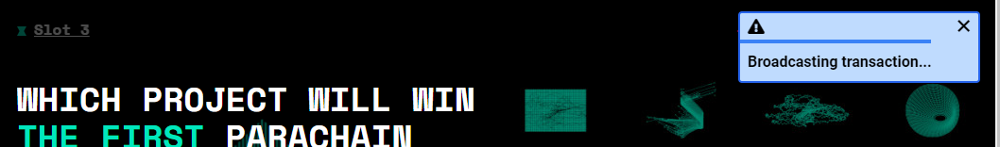

## Create a Zeitgeist account

### PC

- The easiet way to create and maintain accounts in the polkadot ecosystem is
  using the `Polkadot{.js} extension` for Chrome or Firefox, both available
  [here](https://polkadot.js.org/extension/)

- You will need an account, which you can create using the extension.
  **Attention！** You **MUST** write down and secure your mnemonic seed which
  can be used to restore your wallet. Keep it secure as it will recreate your
  account without a password or any further authorisation.

  

- When finished, you will get an account like this.

  

- Select either "Use on any chain" or "Zeitgeist Battery Park" in the side menu
  of the new account

- Copy your new Zeitgeist address, you can use it now!

(If you already loaded the Kusama Derby page, you may need to reload before it
connects to the extension)

## Ask Faucet for Testnet Tokens (ZBP)

- To participate in the Derby, you'll first need to get our testnet token - test
  ZTG.

- Join our [Discord](https://discord.com/invite/xv8HuA4s8v) and enter the room
  named faucet.

  

- Send a message like this `!drip 5Hxxxxxxxxxxxxxxxxxxxxxxxxxxxxxxxxxxxxxxxxxx`
  to get test ZTG sent to your account. In this command, replace
  `5Hxxxxxxxxxxxxxxxxxxxxxxxxxxxxxxxxxxxxxxxxxx` with your Zeitgeist address.
  Make sure this is the address you have access to - you won't get a second
  chance!

- If you had a KSM account with a KSM balance on May 11, 2021 when the snapshot
  was taken, you can also claim an equivalent amount of ZBP from the faucet. See
  [using the faucet](/using-the-faucet.md) for instructions on how that can be
  done.

## Make your Prediction on Zeitgeist

- Open up [the Kusama Derby dapp](https://proto.zeitgeist.pm/kusama-derby)

- First, you need to link your wallet to our dapp. Just click this.

  

- Now you can make a prediction!

  

- After choosing which slot you want to predict, you'll see the current state of
  that market - the further the 'horse', the more ZBP was bet on it. Below, you
  can add whichever prediction you choose.

  

  

  

- If you want to bet on a horse winning, you want to **BUY** - just click the
  `BUY` button and fill in the amount. The top number is how many ZTG you want
  to spend on your bet, and the lower one will update with how many **OUTCOME
  TOKENS** you will receive. For example, if you want to bet 10 ZTG, because the
  `Price` is 0.1422, you can get 10/0.1422=70.32 OUTCOME TOKENS (excluding the
  **Fee**) which can be converted to 70.32 ZTG (minus the fee) if your horse
  comes in first. Similarly, if you want to receive 10 ZTG if you win, the cost
  is 1.422 ZTG now.

  

- When you've entered the details of your bet, click `Sign Transaction` and you
  will get this page. You will need to confirm using the password you set up for
  your Zeitgeist account, and click `Sign Transaction` .

  

- If you can see the message 'Swapped!', you placed your bet successfully.
  Congratulations!

  

  
