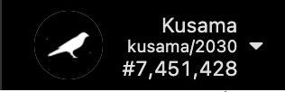

Zeitgeist's test network [Battery Park](./battery-park) uses the ZBP token,
instead of the ZTG. ZBP is provided to users through a frictioned faucet on
Discord in order to allow for testing and experimentation.

__NOTE:__ Due to the presence of a click-farm attack on our faucet we needed to take an
extra measure to protect and the integrity of the Kusama Derby campaign. For this reason,
we decided to put the faucet behind a $2.00 paywall. All of the proceeds will be donated to India
COVID Relief Funds. We hope you understand. The faucet can now be accessed from [this link](https://launchpass.com/kusama-derby-faucet/faucet).

## Getting ZBP

### Using the !drip command

The normal way to get ZBP from the faucet is to use the !drip command.

- First create a new Zeitgeist account (standard Substrate account) using the
  Polkadot-JS Extension that is available
  [here](https://polkadot.js.org/extension/).
- Follow the instructions
  [here](./how-to-participate-in-derby#create-a-zeitgeist-account) for creating
  an account.
- Go to Zeitgeist's Discord server and enter into the #faucet channel.
- Copy your address from the extension, ensure that it's in Substrate generic
  format (begins with a "5").
- Type in `!drip <address>` to the faucet channel.
- The faucet should respond that it sent you some ZBP.
- After completing this you will have a 24 hour cooldown until you can get more
  ZBP.

### Using the !claim command

As a special bonus to KSM holders during the
[Kusama Derby](https://proto.zeitgeist.pm/kusama-derby), the faucet will allow
any account that held KSM on the snapshot day of May 11, 2021 to claim an
equivalent amount of ZBP for usage on the testnet.

In order to make the claim you will need to sign a message using your KSM
account. There may be multiple ways to do this but for this guide we show you
using Polkadot-JS Apps, which is available [here](https://polkadot.js.org/apps).

Go to Apps and switch the network to Kusama.



Go to the "Developer" and select "Sign and Verify".


Now it is expected that you have a Zeitgeist account (Substrate standard
account) ready, if you do not please follow the instructions
[here](./how-to-participate-in-derby#create-a-zeitgeist-account) to create one.

Copy and paste your Zeitgeist account address into the field that says "sign the
following data". Click "Sign message" and confirm any prompts that ask for
confirmation.

Now you should have a hex string that looks like this:

`0xbee763936b767363bce2f102b87e4da48a74732d94385e29e72c0cb77e39f1680b7edd006721887807169d0122c77a471e8cae1cb710cfd7839a41e07909ff82`

Now you will go to the faucet and type the following command, using your own KSM
address, ZTG address, and signed message as the arguments:

```
!claim <ztg_address> <ksm_address> <signed_message>
```

If all is successful you will see the faucet respond that it sent you an
equivalent amount of ZBP as your Kusama account had on the snapshot day. This
claim can only be done once.


