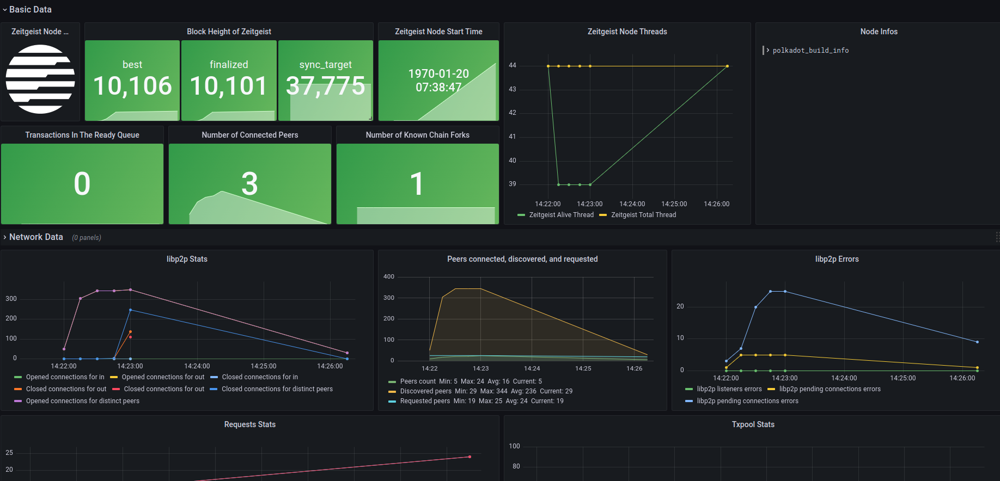

# How to monitor your node

## Prerequisites

Prepare the node operating environment, specific information can follow
[this article](https://docs.zeitgeist.pm/battery-station)

## Install Prometheus and configure the environment

We use [Prometheus](https://prometheus.io/docs/introduction/overview/) as the
node data collection tool

### Configure the Prometheus environment

1. To prevent Prometheus from logging in, we need to set `--no-create-home` and
   create a user for Prometheus

   ```bash
   sudo useradd --no-create-home --shell /usr/sbin/nologin prometheus
   ```

2. Create a directory where the configuration and executable files are stored

   ```bash
   sudo mkdir /etc/prometheus
   sudo mkdir /var/lib/prometheus
   ```

3. Modify folder ownership

   ```bash
   sudo chown -R prometheus:prometheus /etc/prometheus
   sudo chown -R prometheus:prometheus /var/lib/prometheus
   ```

### Install Prometheus

1. After configuring the environment, we start the installation. You can check
   the latest version in the
   [Releases](https://github.com/prometheus/prometheus/releases) of the official
   Github Repo and replace the version of the following command:

   ```bash
   sudo apt-get update && apt-get upgrade
   wget https://github.com/prometheus/prometheus/releases/download/v2.32.1/prometheus-2.32.1.linux-amd64.tar.gz
   tar xfz prometheus-*.tar.gz
   cd prometheus-2.32.1.linux-amd64
   ```

2. After the download is complete, there will be two executable files and two
   folders in the current path folder:

   

3. Copy the executable file to the specified folder and modify the ownership:

   ```bash
   sudo cp ./prometheus /usr/local/bin/
   sudo cp ./promtool /usr/local/bin/
   sudo chown prometheus:prometheus /usr/local/bin/prometheus
   sudo chown prometheus:prometheus /usr/local/bin/promtool
   ```

4. Copy the folder to the specified folder and modify the ownership:

   ```bash
   sudo cp -r ./consoles /etc/prometheus
   sudo cp -r ./console_libraries /etc/prometheus
   sudo chown -R prometheus:prometheus /etc/prometheus/consoles
   sudo chown -R prometheus:prometheus /etc/prometheus/console_libraries
   ```

5. Delete redundant folders

   ```bash
   cd .. && rm -rf prometheus*
   ```

6. Test whether the Prometheus installation is successful

   ```bash
   promtool check config /etc/prometheus/prometheus.yml
   ```

7. Modify the ownership of the configuration file

   ```bash
   sudo chown prometheus:prometheus /etc/prometheus/prometheus.yml
   ```

You can also choose to install through the official documentation

<https://prometheus.io/docs/prometheus/latest/installation/>

### 2.3. Configure Prometheus environment

After the installation is complete, we need to configure the Prometheus
environment as follows:

```bash
sudo vim /etc/prometheus/prometheus.yml
```

Fill in:

```yaml
global:
  scrape_interval: 15s
  evaluation_interval: 15s

rule_files:
  # - "first.rules"
  # - "second.rules"

scrape_configs:
  - job_name: "prometheus"
    scrape_interval: 5s
    static_configs:
      - targets: ["localhost:9090"]
  - job_name: "zeitgeist_node"
    scrape_interval: 5s
    static_configs:
      - targets: ["localhost:9616"]
```

### Run Prometheus

Run the following command in Terminal:

```bash
sudo -u prometheus /usr/local/bin/prometheus --config.file /etc/prometheus/prometheus.yml --storage.tsdb.path /var/lib/prometheus/ --web.console.templates=/etc/prometheus/consoles --web.console.libraries=/etc/prometheus/console_libraries
```

After the operation is successful, the relevant log will be printed out.

Enter `http://127.0.0.1:9090/graph` in the browser to view and query related
information

#### Set Prometheus as a system service and run it automatically

1. Create service file

   ```bash
   sudo vim /etc/systemd/system/prometheus.service
   ```

2. Enter the following configuration:

   ```yaml
   [Unit]
     Description=Prometheus Monitoring
     Wants=network-online.target
     After=network-online.target

   [Service]
     User=prometheus
     Group=prometheus
     Type=simple
     ExecStart=/usr/local/bin/prometheus \
     --config.file /etc/prometheus/prometheus.yml \
     --storage.tsdb.path /var/lib/prometheus/ \
     --web.console.templates=/etc/prometheus/consoles \
     --web.console.libraries=/etc/prometheus/console_libraries
     ExecReload=/bin/kill -HUP $MAINPID

   [Install]
     WantedBy=multi-user.target
   ```

3. Reload `systemd` and start the service:

   ```bash
   sudo systemctl daemon-reload && systemctl enable prometheus && systemctl start prometheus
   ```

## Install Grafana and configure the environment

We use [Grafana](https://grafana.com/grafana/) as a visualization tool for node
information. Grafana will capture the data provided by Prometheus and visualize
the output in real time, giving node operators a more intuitive experience

### Install Grafana

Enter in Terminal:

```bash
sudo apt-get install -y adduser libfontconfig1
wget https://dl.grafana.com/oss/release/grafana_8.3.3_amd64.deb
sudo dpkg -i grafana_8.3.3_amd64.deb
```

The specific [latest version](https://grafana.com/grafana/download) can be found
on the Grafana official website

### Run and automatically run Grafana as a system service

Enter in Terminal:

```bash
sudo systemctl daemon-reload
sudo systemctl enable grafana-server
sudo systemctl start grafana-server
```

### Configure Grafana data source

1. Enter the following IP in the browser and log in:
   `http://127.0.0.1:3000/login`, the default account and password are both
   `admin`.

2. Find the `Configuration` button on the left, select `Data Sources`, and after
   entering, select `Add data source`.
3. You can choose according to the data source you use. **In this article, we
   choose Prometheus.**
4. Set the data source parameters, set the `URL` to `http://localhost:9090`,
   select the bottom `Save & Test`, if you see `Data source is working`, it
   means there is no problem with the configuration.

## Monitor Zeitgeist node metrics

After completing all the above configurations, we can import the
[pre-designed Dashboard](https://grafana.com/grafana/dashboards/15424) to
monitor the key information of the node.

1. Select `Import` in the `Create` column of the menu bar, we can choose to
   import from the grafana.com community with ID or through the
   [Json file](https://github.com/Whisker17/Zeitgeist-Node-Monitor/blob/main/zeitgeist-node-monitor.json)
   to import.

2. Select `Load`, confirm again that the column of `Prometheus` is not selected
   wrong, and click `Import`.

3. To run the Zeitgeist node locally, please use the following command line to
   execute (currently only supports binary file operation)

   ```bash
   ./zeitgeist --chain=battery_station --pruning=archive --prometheus-port=9616
   ```

4. After waiting a few seconds, you will see the data update in the interface.

   

## Reference

- [Monitor your node](https://wiki.polkadot.network/docs/maintain-guides-how-to-monitor-your-node)
