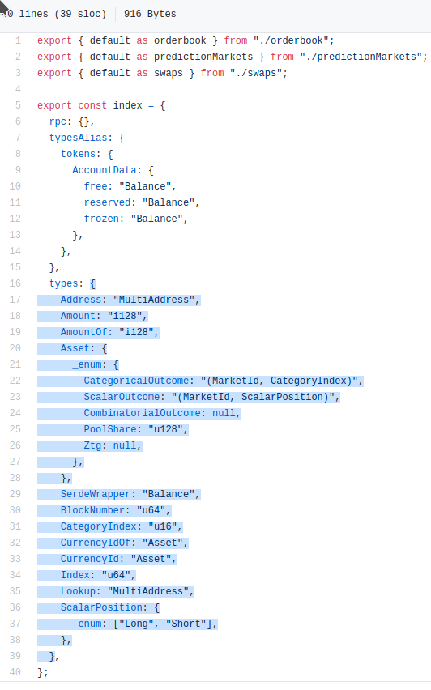

### Accessing Zeitgeist through [polkadot.js.org/apps](https://polkadot.js.org/apps/?rpc=wss%3A%2F%2Fbp-rpc.zeitgeist.pm)

##### I see `<unknown>` as the result of my query to Chain state, or from making an RPC call

Most of the time, this is the result of misconfugred types in
polkadot.js.org/apps. However, this result will also show for a brief moment
while the page is waiting for the network request, so if the network is very
slow or the connection breaks, then `<unkown>` will continue to show

To diagnose which of these problems you are experiencing, open your browser's
Dev Tools. Usually you can do this by pressing F12. Dev Tools contains a console
(you may have to select the tab for it) which outputs errors encountered by the
page. If you see an error along the lines of:

> DRR: Unable to decode ... createType ... Decoded input doesn't match input,
> received 0x..... , created 0x.....

it is because polkadot.js.org/apps in your browser is using a different set of
type definitions than the Zeitgeist chain itself.

polkadot.js.org/apps fetches type definitions from
[our bundled packages](https://www.npmjs.com/search?q=%40zeitgeistpm) on npm.
Sometimes we have to upgrade the type definitions to support new features and
polkadot.js/apps can take up to 24 hours to fetch the new definitions

Npm is almost always up to date with the types we are using on the Zeitgeist
chain but you can check by comparing the version number of
[our published npm package](https://www.npmjs.com/package/@zeitgeistpm/type-defs)
with that on
[our Github repository](https://github.com/zeitgeistpm/tools/blob/main/packages/type-defs/package.json).

If you find the type defintions mismatching, you can easily update them manually
by taking
[the new type definitions from the Github repository](https://github.com/zeitgeistpm/tools/blob/main/packages/type-defs/src/index.ts),
selecting only the object named `types`, and copying and pasting it into
[the Settings | Developer tab](https://polkadot.js.org/apps/?rpc=wss%3A%2F%2Fbp-rpc.zeitgeist.pm#/settings/developer)
in polkadot.js/apps. Don't forget to press `Save`!

If you cannot `Save` the new types and the input area remains pink, ensure that
the object is strictly JSON formatted, for example by using Javascript's
`JSON.stringify` method or
[a formatting tool](https://www.freeformatter.com/json-formatter.html).

### Accessing Zeitgeist through the [SDK](https://github.com/zeitgeistpm/tools)

##### I want to use the SDK, but it's doing something I didn't expect!

We will support the SDK after is it released. Don't worry, you won't have too
long to wait!

### Accessing Zeitgeist through the [CLI](https://github.com/zeitgeistpm/tools)

##### I want to use the CLI, but it's doing something I didn't expect!

Sorry - you need to wait for the SDK to be released!
